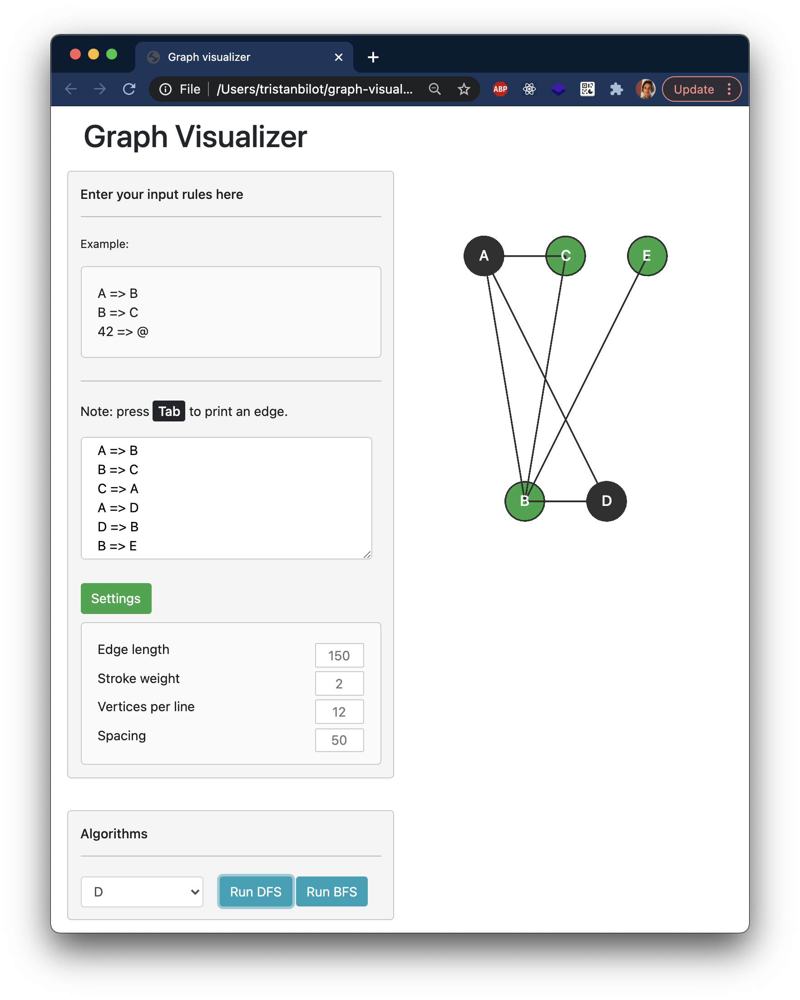

# graph-visualizer
A web builder and visualizer for graphs. Also graphic implementation of BFS and DFS algorithms.

##
Written in native JavaScript, I've built this tool when learning about graph theory and traversal algorithms.
The rules of the graph should be writen on separated lines like so:

```
a => b
b => c
...
```

<p align="center">
  
</p>
